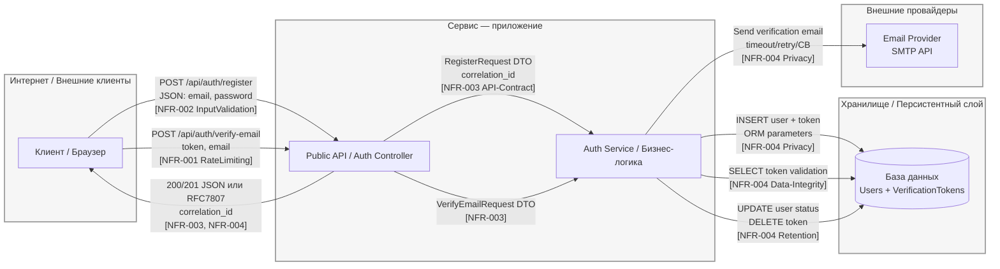

# TM - Требования безопасности + Модель угроз + ADR

> Этот файл - **индивидуальный**. Его проверяют по **rubric_TM.md** (5 критериев × {0/1/2} → 0-10).
> Подсказки помечены `TODO:` - удалите после заполнения.
> Все доказательства/скрины кладите в **EVIDENCE/** и ссылайтесь на конкретные файлы/якоря.

---

## 0) Мета

- **Проект (опционально BYO):** TODO: ссылка / «учебный шаблон»
- **Версия (commit/date):** TODO: abc123 / 2025-10-13
- **Кратко (1-2 предложения):** TODO: Система аутентификации и регистрации 
---

## 1) Архитектура и границы доверия (TM1, S04)

- **Роли/активы:** TODO: пользователь, админ; ПДн/токены/платёжные данные/модели …
- **Зоны доверия:** Internet / DMZ / Internal / Device (если есть)
- **Context/DFD:**

## 1) Архитектура и границы доверия (TM1, S04)

- **Роли/активы:** клиенты (браузер, мобильные устройства); PII (email, IP), verification tokens, хэши паролей
- **Зоны доверия:** Internet / API Gateway / Application Services / Database / External Email Provider
- **Context/DFD:**

Критичные интерфейсы и допущения:
Internet → API Gateway: недоверенная зона, требует защиты от DoS и инъекций
API Gateway → Application Services: внутренняя сеть, частично доверенная
Application Services → Database: доверенная зона, но требует защиты PII
Application Services → Email Provider: внешняя недоверенная зависимость

## 2) Реестр угроз STRIDE (TM2, TM3, S04)

| ID  | STRIDE | Компонент/поток | Угроза (кратко)                                   | L | I | L×I |
|-----|--------|------------------|----------------------------------------------------|---|---|-----|
| R-01 | **D**  | Internet → API (/register, /verify) | DoS/abuse публичных auth-эндпоинтов                | 4 | 4 | 16  |
| R-02 | **D**  | Service → Email Provider | Отказ внешнего email-провайдера                 | 4 | 4 | 16  |
| R-03 | **I**  | API/Service Logs & Errors | Утечка PII через observability                  | 4 | 4 | 16  |
| R-04 | **S**  | Database Token Storage | Слабая безопасность verification-токенов         | 3 | 4 | 12  |
| R-05 | **T**  | Service → Database | SQL injection через уязвимости доступа к БД        | 2 | 5 | 10  |
| T06 | **E**  | Service Account → Database | Избыточные привилегии сервисного аккаунта      | 2 | 5 | 10  |
| T07 | **R**  | Admin Operations | Отказ от административных действий                  | 3 | 3 | 9   |

---

## 3) Приоритизация и Top-5 _(TM3, S04)_

1) **R-01 DoS/abuse публичных auth-эндпоинтов** - L×I=16; Почему: публичная поверхность, легкая автоматизация → L=4; блокировка онбординга пользователей → I=4  
2) **R-03 Утечка PII через observability** - L×I=16; Почему: частые ошибки конфигурации логирования → L=4; массовая компрометация персональных данных → I=4  
3) **R-02 Отказ внешнего email-провайдера** - L×I=16; Почему: нестабильность внешних сервисов → L=4; полная остановка процесса регистрации → I=4  
4) **R-04 Слабая безопасность verification-токенов** - L×I=12; Почему: требует определенных условий для эксплуатации → L=3; компрометация учетных записей множества пользователей → I=4  
5) **R-05 SQL injection через уязвимости доступа к БД** - L×I=10; Почему: риск снижен использованием ORM → L=2; критичный ущерб целостности данных → I=5  

---

## 4) Требования (S03) и ADR-решения (S05) под Top-5 (TM4)

### NFR-001. Rate Limiting для auth-эндпоинтов

- **AC (GWT):**
  - **Given** IP адрес клиента, **When** 5 запросов к `/api/auth/verify-email` за 60 секунд, **Then** запросы 4-5 получают 429 и заголовок Retry-After
  - **Given** IP адрес клиента, **When** 15 запросов к `/api/auth/login` за 60 секунд, **Then** запросы 11-15 получают 429 и заголовок Retry-After

### NFR-002. Input Validation и размеры запросов

- **AC (GWT):** 
  - **Given** тело запроса размером 128 KiB, **When** `POST /api/auth/register`, **Then** ответ 413 с телом в RFC 7807
  - **Given** тело с полем `debug`, **When** `POST /api/auth/register`, **Then** 400 в RFC 7807; схема DTO отклоняет неизвестные поля

### NFR-003. API Errors в формате RFC7807

- **AC (GWT):** 
  - **Given** серверная ошибка при `POST /api/auth/register`, **When** клиент получает ответ, **Then** `Content-Type=application/problem+json`, присутствуют `type/title/status/detail`, нет стэктрейсов, есть `correlation_id`

### NFR-004. PII Protection и Data Retention

- **AC (GWT):**
  - **Given** DTO с `email` и `ip`, **When** выполняется логирование на любом уровне, **Then** поля PII замаскированы/отсутствуют
  - **Given** учётная запись осталась неподтверждённой, **When** проходит 30 дней, **Then** запись и verification-токен удаляются согласно политике ретенции

---

### Краткие ADR (минимум 2) - архитектурные решения S05

#### ADR-001 - API Gateway Rate Limiting & Request Validation

- **Context:** R-01, NFR-001, NFR-002; DoS/abuse публичных auth-эндпоинтов
- **Decision:** Rate limiting на уровне API Gateway (3/min для verify-email, 10/min для login) + лимит размера запросов 64 KiB
- **DoD:** **Given** IP делает 5 запросов к `/api/auth/verify-email` за 60s, **Then** запросы 4-5 получают 429 + Retry-After
- **Owner:** DevSecOps Team
- **Evidence:** EVIDENCE/S05_ADR_api-gateway-rate-limiting.md

#### ADR-002 - PII Protection in Logs & Errors

- **Context:** R-03, NFR-003, NFR-004; Утечка PII через observability
- **Decision:** Маскировка PII в логах + RFC7807 ошибки без стэктрейсов + retention policy 30 дней
- **DoD:** **Given** DTO с email="user@example.com", **When** логируется, **Then** показывает email="[REDACTED]"
- **Owner:** Backend Team
- **Evidence:** EVIDENCE/S05_ADR_pii-protection-logs-errors.md

#### ADR-003 - External Service Resilience Pattern

- **Context:** R-02, NFR-004; Отказ внешнего email-провайдера
- **Decision:** Timeouts + Retry с jitter + Circuit Breaker для внешних вызовов email провайдера
- **DoD:** **Given** зависание email сервиса, **When** вызов отправки email, **Then** timeout ≤ 2s, retry ≤ 3, CB активируется при error-rate ≥50%
- **Owner:** Backend Team
- **Evidence:** EVIDENCE/S05_ADR_external-service-resilience.md

---

## 5) Трассировка Threat → NFR → ADR → (План)Проверки (TM5)

| Threat | NFR     | ADR     | Чем проверяем (план/факт)                                                                 |
|--------|---------|---------|-------------------------------------------------------------------------------------------|
| R-01   | NFR-001, NFR-002 | ADR-001 | E2E тесты rate limiting → EVIDENCE/rate-limit-tests-2024-06-15.md Нагрузочное тестирование → EVIDENCE/load-test-auth-endpoints.md |
| R-03   | NFR-003, NFR-004 | ADR-002 | Security scan на PII в логах → EVIDENCE/pii-scan-results-2024-06-15.md Review образцов логов → EVIDENCE/log-samples-review.md |
| R-02   | NFR-004 | ADR-003 | Мониторинг timeout/retry метрик email провайдера → EVIDENCE/email-provider-metrics.md Тесты circuit breaker → EVIDENCE/circuit-breaker-tests.md |
| R-04   | NFR-004 | (Backlog) | Аудит токенов на энтропию и TTL → EVIDENCE/token-security-audit.md |
| R-05   | NFR-002 | (Backlog) | SAST проверка параметризованных запросов → EVIDENCE/sast-sql-injection-2024-06-15.md |

---

## 6) План проверок (мост в DV/DS)

### 6.1 SAST / Secrets / SCA

* **Цель:** Проверка исходного кода на уязвимости, контроль секретов и зависимостей
* **Инструменты:** SonarQube / GitHub CodeQL (SAST), GitLeaks (Secrets), OWASP Dependency-Check (SCA)
* **Что проверяем:** Отсутствие hard-coded секретов, уязвимости в зависимостях, безопасные паттерны кода
* **Документирование:** Отчёты в `EVIDENCE/SAST/`, `EVIDENCE/Secrets/`, `EVIDENCE/SCA/`
* **Периодичность:** При каждом CI/CD пайплайне

### 6.2 SBOM

* **Цель:** Контроль используемых компонентов и библиотек
* **Инструменты:** CycloneDX генератор
* **Что проверяем:** Полный список всех библиотек и зависимостей, версии компонентов
* **Документирование:** SBOM в `EVIDENCE/SBOM/` в формате JSON
* **Использование:** Для аудита и интеграции с SCA

### 6.3 DAST (Dynamic Application Security Testing)

* **Цель:** Тестирование приложения в рабочем окружении на веб-уязвимости
* **Инструменты:** OWASP ZAP
* **Что проверяем:** Public API endpoints (`/api/auth/*`), корректность ответов на некорректные данные, rate limiting
* **Стенд:** Staging environment
* **Документирование:** Отчёты в `EVIDENCE/DAST/` с найденными уязвимостями и рекомендациями

### 6.4 Нагрузочное тестирование

* **Цель:** Проверка производительности и устойчивости к нагрузке
* **Инструменты:** k6
* **Что проверяем:** Rate limiting поведение, latency P95 для auth endpoints, устойчивость к DoS
* **Документирование:** Отчёты в `EVIDENCE/load-testing/`
* **Метрики:** P95 ≤ 500ms для login, успешное срабатывание rate limits

---

## 7) Самопроверка по рубрике TM (0/1/2)

- **TM1. Архитектура и границы доверия:** [x] 2  
- **TM2. Покрытие STRIDE и уместность угроз:** [x] 2  
- **TM3. Приоритизация и Top-5:** [x] 2  
- **TM4. NFR + ADR под Top-5:** [x] 2  
- **TM5. Трассировка → (план)проверок:** [x] 2  

**Итог TM (сумма):** 10/10
